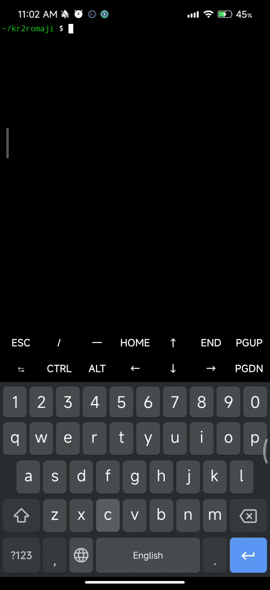

# korea-romaji-cli


## Requirements
  - rust
  - cargo <= 1.68.2


## Installing rust
```sh
curl --proto '=https' --tlsv1.2 -sSf https://sh.rustup.rs | sh
```


## Installing and usage
```sh
git clone https://github.com/alk-neq-me/korea-romaji-cli
cd korea-romaji-cli
cargo run
```

{loop=""}
